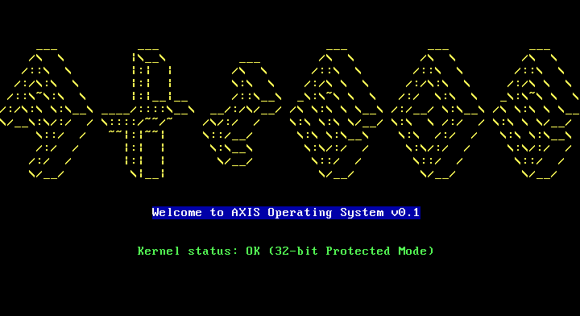
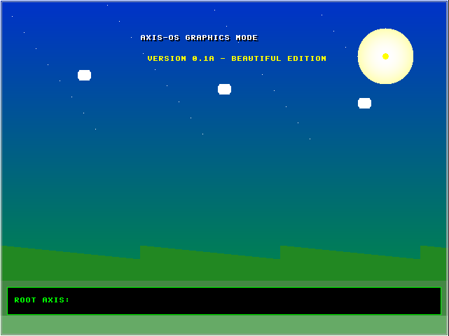
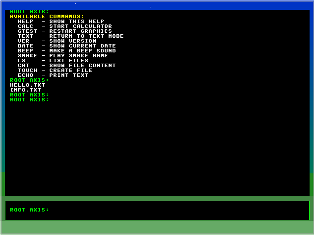
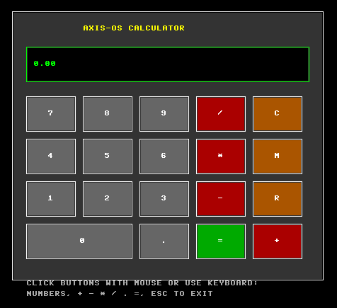
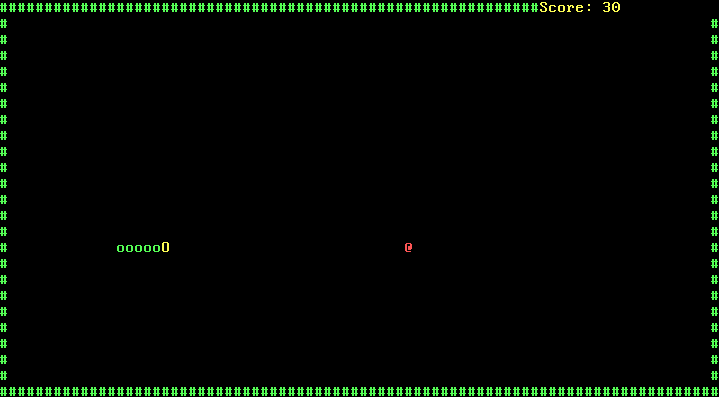
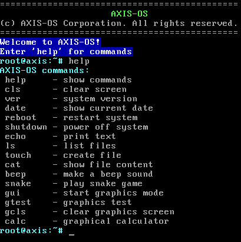

# AxisOS — x86 Operating System

<p align="center">
  
</p>

<p align="center">
  
  
  
  
</p>

<p align="center">
  <b>A fully functional x86 operating system built from scratch</b><br>
  Graphics mode • Calculator • Snake game • Filesystem • Command line
</p>

---

## About The Project

**AxisOS** is a hobby operating system developed from absolute zero for the x86 architecture. Written primarily in C with assembly where it matters, this project demonstrates core OS concepts including bootloading, protected mode switching, interrupt handling, graphics rendering, filesystem emulation, and application development.

The system boots from a standard BIOS, loads a second-stage kernel, switches to 32-bit protected mode, and provides both a text-based terminal and a beautiful graphical interface with interactive applications.

---

## Key Features

### System Core
- **Two-stage bootloader** – First 512-byte sector loads 60+ sectors kernel
- **32-bit protected mode** – Full access to 4GB memory space
- **GDT implementation** – Proper segmentation for code and data
- **Real-time clock** – Read current date/time from CMOS

### Graphics Subsystem
- **VBE 640x480x32** – Linear framebuffer graphics mode
- **Custom 8x8 font** – Software-rendered bitmap characters
- **Gradient backgrounds** – Dynamic sky with sun, clouds, and mountains
- **Graphics primitives** – Lines, rectangles, filled shapes
- **On-screen console** – Type commands directly on graphical display

### Input Handling
- **PS/2 keyboard driver** – Full scancode to ASCII conversion
- **Command history** – Arrow up to recall previous commands
- **Backspace support** – Delete characters
- **ESC handling** – Quick return to text mode

### Filesystem
- **FAT16-like structure** – Directory entries in memory
- **File operations** – `ls`, `touch`, `cat` commands
- **8.3 filename format** – Compatible with standard FAT naming

### Applications
- **Graphical calculator** – Interactive with keyboard input
  - Basic operations: `+ - * /`
  - Memory functions: `M` (save), `R` (recall)
  - Clear: `C`, Equals: `=` or `Enter`
- **Snake game** – Classic arcade game in text mode
  - Arrow key controls
  - Score tracking
  - Collision detection

### Terminal Features
- **Colored output** – Different colors for prompts, errors, results
- **Scrolling** – Automatic when screen fills
- **Command set** – 20+ built-in commands
- **Beep sound** – PC speaker support

---

## Screenshots

<div align="center">

### Main Screen


### Graphics Mode


### Graphics Console


### Calculator Application


### Snake Game


### Command List


</div>

---

## Getting Started

### Prerequisites

| Tool | Purpose | Download |
|------|---------|----------|
| **NASM** | Assembler | [nasm.us](https://www.nasm.us) |
| **MinGW** | GCC Compiler | [mingw.org](http://www.mingw.org) |
| **QEMU** | Emulator (recommended) | [qemu.org](https://www.qemu.org) |
| **Bochs** | Alternative emulator | [bochs.sourceforge.io](https://bochs.sourceforge.io) |


## Command Reference

### System Commands
| Command | Description |
|---------|-------------|
| `help` | Display all available commands |
| `cls` | Clear the screen |
| `ver` | Show system version |
| `date` | Display current date |
| `reboot` | Restart the system |
| `shutdown` | Halt the system |

### File Operations
| Command | Description |
|---------|-------------|
| `ls` | List files in current directory |
| `touch [name]` | Create a new file |
| `cat [name]` | Display file contents |
| `echo [text]` | Print text to screen |

### Applications
| Command | Description |
|---------|-------------|
| `gui` | Switch to graphics mode |
| `calc` | Launch graphical calculator |
| `snake` | Start Snake game |
| `beep` | Generate sound via PC speaker |

### Graphics Mode Commands
| Command | Description |
|---------|-------------|
| `text` | Return to text mode |
| `gtest` | Refresh graphics display |
| `gcls` | Clear graphics screen |
| `ESC` | Quick return to text mode |

### Build Instructions

```bash
# Clone the repository
git clone https://github.com/yourusername/AxisOS.git
cd AxisOS

# Run the build script (Windows)
build.bat

# Manual build (if script fails)
nasm -f bin bootloader.asm -o stage1.bin
nasm -f elf32 stage2.asm -o stage2.o
gcc -m32 -ffreestanding -nostdlib -c kernel.c -o kernel.o
ld -m i386pe -Ttext 0x8000 -o kernel.elf stage2.o kernel.o
objcopy -O binary kernel.elf kernel.bin
copy /b stage1.bin + kernel.bin AxisOS.bin\
